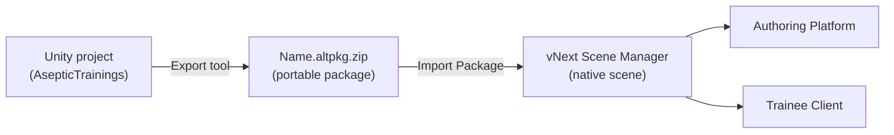
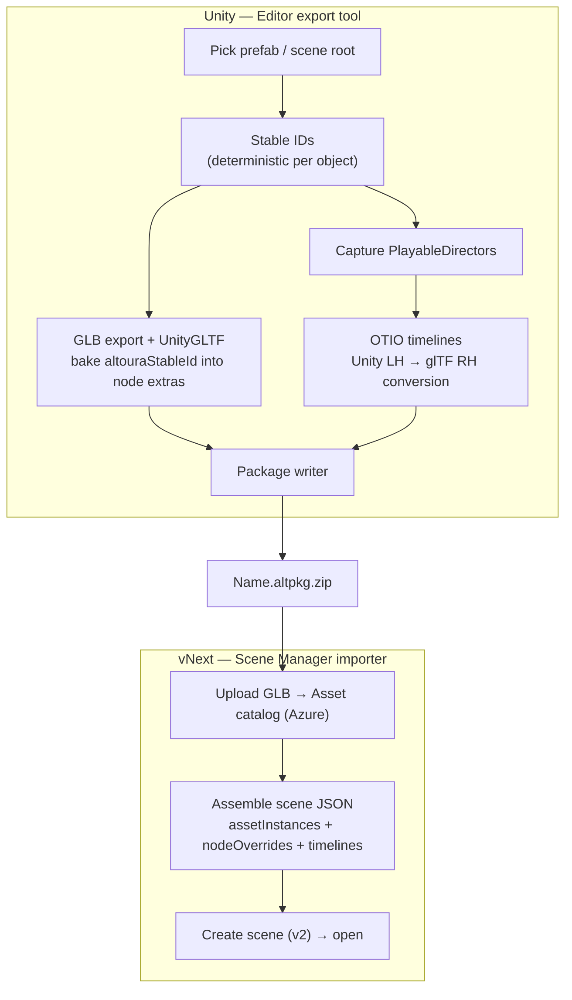
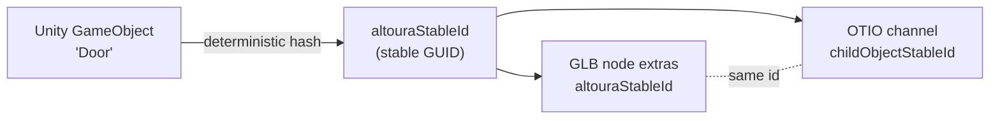
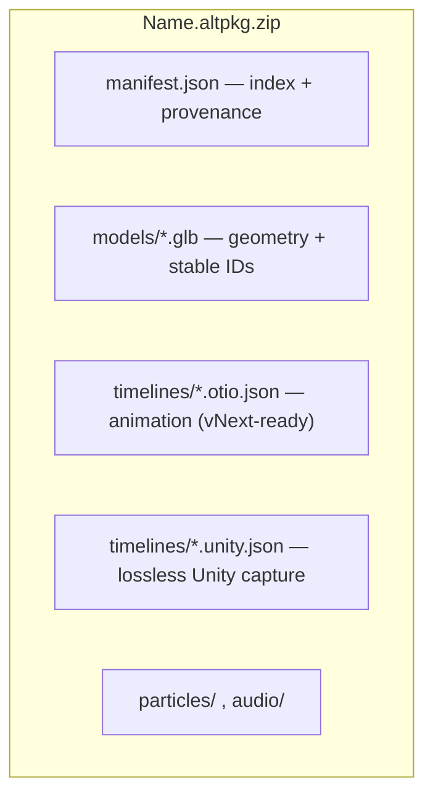

<!--
HOW TO USE THIS DECK
- This is a Marp deck. Render with the Marp CLI or the "Marp for VS Code" extension.
  - Preview: open in VS Code with Marp extension.
  - Export:  marp asset-migration-walkthrough.md --pdf   (or --pptx, --html)
- Mermaid graphs: Marp does not render mermaid by default. Two options:
  (a) Paste each graph into https://mermaid.live and screenshot into the slide, or
  (b) Use a mermaid-enabled renderer.
- Presenter notes are in HTML comments under each slide.
- Assumed audience: mixed engineering (Unity + web). Assumed length: ~30 min + demo.
  To shorten: cut slides 5, 11, 12 and keep the demo.
-->

# Altoura Asset Migration
## From Unity training scenes to the vNext web platform

Team feature walkthrough

<!--
One-line hook: "We can now take a fully authored Unity training scene — geometry,
animations, timing — and bring it into the vNext web editor without re-authoring by hand."
-->

---

## Agenda

1. The problem — why this exists
2. What we built (in one picture)
3. The pipeline, end to end
4. Key concepts: stable IDs, timelines, visibility
5. Anatomy of a `.altpkg.zip`
6. **Live demo** — Unity export → vNext import
7. What works today
8. Known limitations & gotchas
9. Roadmap
10. Q&A

<!--
Set expectations: ~half concepts, then a live demo, then honest limitations + roadmap.
-->

---

## The problem

- Rich training content already exists in **Unity**: geometry, PlayableDirector **timelines**, activation/animation, audio.
- vNext (the web platform) is where authoring + trainee delivery now live.
- Historically, moving a scene meant **re-authoring by hand** — slow, error-prone, and the animation timing rarely survived.
- We need a **repeatable, high-fidelity** path: Unity content in, a native vNext scene out.

<!--
Emphasize the pain: it's not just geometry — it's the *timelines and timing* that were painful to redo.
The whole point is preserving animation + bindings, not just the mesh.
-->

---

## What we built (in one picture)

A Unity **Editor export tool** and a vNext **Scene Manager importer**, connected by a portable package.

- One artifact — the `.altpkg.zip` — is the clean hand-off boundary.
- Once imported, it is a **normal vNext scene**: saved to the cloud, editable, playable.

<!--
Key framing: the package is a *contract*. Unity side and web side evolve independently as long as
the package format holds. After import there is nothing "special" about the scene.
-->

---

## The pipeline, end to end

<!--
Walk left-to-right. Two independently owned halves. Call out that the "glue" is stable IDs (in the GLB)
plus OTIO (the timelines). The importer reuses the *existing* Scene Manager upload + save paths — we didn't
invent new storage.
-->

---

## Key concept 1 — Stable IDs

The problem: how does a timeline that animates "Door" find the right mesh after export?

- Every exported object gets a **deterministic** stable ID (same object → same ID every export).
- The ID is baked into the **GLB node** and referenced by every **timeline channel**.
- Bindings resolve by **ID, not by name** — so renaming or re-ordering never breaks animation.

<!--
This is the single most important idea. Names are unreliable (duplicates, sanitization). IDs are the anchor.
This is also why the `Floor` → `Floor_1` rename (later slide) does NOT break anything.
-->

---

## Key concept 2 — Timelines as OTIO

- Unity PlayableDirector tracks → **OTIO** (`*.otio.json`), an open timeline interchange format vNext already understands.
- We capture **position / rotation / scale**, **activation (visibility)**, and **audio** tracks.
- **Coordinate conversion** happens at export: Unity (left-handed) → glTF/three.js (right-handed).
- Keyframe values are emitted in exactly the shape the vNext `AnimationEngine` applies (`[x,y,z]`, quaternion `[x,y,z,w]`).

<!--
Don't go deep on OTIO internals. The point: timing + motion survive, and the handedness math is done once,
at export, verified against what the web engine expects.
-->

---

## Key concept 3 — Visibility

glTF has no "is this visible" flag, but Unity scenes rely on it heavily.

- Objects **deactivated** in Unity (`activeSelf = false`) → flag `altouraInitiallyActive: false`.
- Objects whose **MeshRenderer is disabled** → flag `altouraRendererEnabled: false`.
- On import, both become a **node override** (`isVisible: false`) so the scene loads matching Unity.
- Timelines that later activate an object still take over during playback.

<!--
Tie back to a real bug we fixed: deactivated objects were showing up visible; now they load hidden.
Disabled-renderer support was just added on the Unity side.
-->

---

## Anatomy of a `.altpkg.zip`

- `manifest.json` ties it together: which model, which timelines, root stable ID.
- `*.glb` — one model per package, stable IDs in node extras.
- `*.otio.json` — what the importer consumes; `*.unity.json` is a lossless backup.

<!--
Show this, then in the demo actually open the zip and point to these folders. Concrete beats abstract.
-->

---

## Live demo

**Unity → package**
1. Open the training scene; show a PlayableDirector timeline (e.g. door open / a character motion).
2. Open **Altoura Migration** export window → pick the root → **Export All Timelines** (optional: Draco).
3. **Export** → produces `Name.altpkg.zip`. Open the zip; point out `manifest.json`, `models/`, `timelines/`.

**Package → vNext**
4. Scene Manager → **File** tab → **Import Package** → select the `.altpkg.zip`.
5. Watch progress: *unpack → upload model → assemble → save*; the new scene opens in a tab.
6. Play a timeline; show a **deactivated** Unity object loading hidden.

<!--
FALLBACKS (have these ready in case live export/network fails):
- Pre-built package on disk: Exports/VT835v4Realscale.altpkg.zip
- A pre-imported scene URL open in another tab.
Keep the demo model SMALL for speed (door slice), then optionally show the big scale-up scene already imported.
-->

---

## What works today

- Geometry: full hierarchy, materials, meshes (quads auto-triangulated for glTF).
- Stable-ID bindings: timelines resolve to the right objects by ID.
- Timelines: position / rotation / scale + activation, with coordinate conversion.
- Initial visibility: deactivated objects and disabled renderers load hidden.
- One-click import in Scene Manager, saved to the cloud like any other scene.

<!--
This is the "we can actually do this now" slide. Be confident but precise — geometry + timelines + visibility.
-->

---

## Known limitations & gotchas

- **Draco compression is stripped on ingest** — the web upload re-exports the GLB (no Draco), so the stored copy is uncompressed. Unity-side Draco only helps package *transfer* size. Plan for size on large scenes.
- **Node names get sanitized** by the web loader: spaces → `_`, dots removed, duplicates suffixed (`Floor` → `Floor_1`). Cosmetic — bindings use IDs, not names. *(Fix to restore original names is in progress.)*
- **Audio & particles**: not yet wired on import (deferred).
- **Single-PUT upload ceiling (~256 MB)** for very large uncompressed GLBs.
- three.js `visible = false` also hides children — matters only for a hidden object that has children meant to keep rendering (rare).

<!--
Being upfront here builds trust. Each item has a mitigation or is on the roadmap. The name one is the
question you'll most likely get from anyone who inspected a GLB.
-->

---

## Roadmap

- ✅ **Phase 1** — Import geometry + timelines, create + open scene.
- ✅ **Phase 2** — Visibility (deactivated + disabled-renderer) as node overrides.
- 🔄 **In progress** — Preserve original object names through import.
- ⏭ **Phase 3** — Audio ingestion (upload + wire audio tracks).
- ⏭ **Later** — Particles, multi-model packages, scale-up validation, round-trip fidelity checks.

<!--
Invite input: which content types matter most to the team's near-term training scenes? That steers Phase 3+.
-->

---

## Q&A / call to action

- What training scenes should we target first?
- Which fidelity gaps are blockers vs. nice-to-have?
- Want to try exporting one of your own scenes?

Thank you.

<!--
Close with a concrete ask: get one real scene from someone in the room queued up as the next test case.
-->

---

## Appendix — glossary

- **`.altpkg.zip`** — the migration package; the hand-off artifact.
- **Stable ID (`altouraStableId`)** — deterministic per-object GUID; the binding anchor.
- **OTIO** — OpenTimelineIO; the timeline interchange format vNext consumes.
- **Node override** — a sparse per-object edit in the scene JSON (used here for initial visibility).
- **Asset instance** — a placed model in a vNext scene, referencing an uploaded catalog asset by GUID.
- **Draco** — mesh compression; applied optionally in Unity, stripped on web ingest.

---

## Appendix — demo checklist

- [ ] Unity project open, target scene loaded, timeline visible.
- [ ] Migration export window reachable (menu).
- [ ] Output folder known; small demo package ready to export.
- [ ] Fallback package on disk: `Exports/VT835v4Realscale.altpkg.zip`.
- [ ] Scene Manager logged in, correct org, dev server running.
- [ ] Backup: a pre-imported scene URL in a second tab.
- [ ] Network check (Azure upload) done beforehand.
